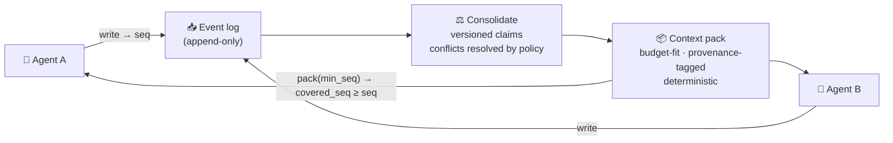

<div align="center">


**Open-source coordination memory for multi-agent AI systems — shared agent memory with
read-your-writes consistency, per-agent access control, and deterministic context packs.**

[](https://github.com/lore-gpt/lore/actions/workflows/ci.yml)
[](LICENSE)
[](https://github.com/lore-gpt/lore/discussions)
[](https://loregpt.ai)

> *Mem0 remembers your user. Zep knows what's true now.*
> ***Lore keeps your agent team in sync*** *— with consistency guarantees, access control, and a token bill that goes down.*

</div>

> 🚧 **Building in the open.** Lore is pre-release. The design is public and evolving through RFCs;
> `v0.1` lands soon. **[→ Join the waitlist](https://loregpt.ai)** for early access and design-partner slots.

---

## Why

Multi-agent systems mostly don't fail because agents can't reason — they fail because agents work over
inconsistent copies of shared state. *(MAST, 1,600+ annotated traces: **36.9%** of multi-agent failures
are inter-agent misalignment; teams burn ~40% of compute re-establishing context.)*

Lore is the memory layer that keeps a **team** of LLM agents working from one reality:

- **Consistency you can call** — `seq` tokens, `covered_seq`, `freshness_lag_ms`: read-your-writes as an
  API contract, not a blog promise. If agent A wrote it, agent B's next pack contains it.
- **Governance built in** — per-agent access control compiled to SQL, trust tiers with quarantine,
  mandatory provenance, human-approved curation.
- **A token bill that goes down** — deterministic, budget-fit context packs maximize prompt-cache hits;
  a built-in meter reports tokens and dollars saved versus raw history.
- **Real open source** — not a library you operate around, a full server: one Go binary with Postgres
  (pgvector + BM25 hybrid search) inside. `docker compose up`, Apache-2.0.

## How it works



1. **Write** — agents stream events; nothing blocks.
2. **Consolidate** — facts become versioned claims; conflicts resolved by policy, not luck.
3. **Pack** — one budget-fit, provenance-tagged, deterministic context block.

```ts
const lore = new LoreClient({ apiKey });
const { seq } = await lore.write({
  runId, agentId: "researcher",
  content: "Auth flow moved to v2 — PR #42 merged",
});

const pack = await lore.pack({
  query: "current state of auth work",
  scopes: { team: "platform" }, minSeq: seq, tokenBudget: 2000,
});

pack.coveredSeq   // ≥ seq → read-your-writes, guaranteed
pack.savedTokens  // the number your CFO will ask about
```

## Quickstart (self-host)

All you need is **Docker** (with Compose):

```bash
git clone https://github.com/lore-gpt/lore
cd lore
docker compose -f infra/docker-compose.yml up -d --build --wait
```

*(Prefer [Task](https://taskfile.dev)? `task compose:up` does the same and is the dev entry point
for lint/test/build too.)*

`up` builds the server and worker, applies migrations, and runs a one-shot that **provisions a first
project** and writes its id and API key to `infra/.lore/credentials`. The default extractor is an offline,
deterministic fixture, so the whole write → consolidate → pack loop runs with no API key. Load your
credentials:

```bash
set -a; source infra/.lore/credentials; set +a   # sets LORE_PROJECT_ID and LORE_API_KEY
```

*(A zero-clone `lore init` that scaffolds this without cloning the repo lands in `v0.1`.)*

**1 · Check health** — unauthenticated, so orchestrators can probe it:

```bash
curl localhost:8080/healthz
# {"status":"ok","version":"0.0.0-dev","db":"ok","queue":"ok","workmem":"ok"}
```

**2 · Create a run** — a run groups a stream of events; the project comes from your key, never the body:

```bash
RUN_ID=$(curl -sX POST localhost:8080/v1/runs \
  -H "Authorization: Bearer $LORE_API_KEY" -H "Content-Type: application/json" \
  | grep -o '"run_id":"[^"]*"' | cut -d'"' -f4)
echo "run=$RUN_ID"
```

**3 · Append an event** — the write path lands on that run:

```bash
curl -X POST localhost:8080/v1/events \
  -H "Authorization: Bearer $LORE_API_KEY" \
  -H "Content-Type: application/json" \
  -d "{\"run_id\":\"$RUN_ID\",\"agent_id\":\"researcher\",\"payload\":{\"note\":\"auth flow moved to v2\"}}"
# {"event_id":"...","seq":1}   (HTTP 202)
```

**4 · Pack context** — a deterministic, budget-fit context pack for the run. `min_seq` asserts
read-your-writes: the pack reflects the event you just wrote (raw until extraction distills it):

```bash
curl -sX POST localhost:8080/v1/pack \
  -H "Authorization: Bearer $LORE_API_KEY" \
  -H "Content-Type: application/json" \
  -d "{\"run_id\":\"$RUN_ID\",\"query\":\"auth work\",\"min_seq\":1}"
# with the lore binary instead of curl:  lore pack --run-id "$RUN_ID" --query "auth work" --min-seq 1
```

**5 · Tear it down:**

```bash
docker compose -f infra/docker-compose.yml down -v   # or: task compose:down
```

Every step above is also a `lore` subcommand for running outside Docker: `lore provision` (create a project
and mint a key), `lore pack` (fetch a context pack), and `lore doctor` (check the database, schema, and
server). Run `lore --help` for the full list.

> **Port 8080 already in use?** Pick a free host port; the container still listens on 8080:
> `LORE_HTTP_PORT=18080 docker compose -f infra/docker-compose.yml up -d --build --wait`

<details>
<summary><b>Configuration</b> — run the binary outside Compose</summary>

Copy [`.env.example`](.env.example) to `.env` and set:

| Variable | Required | Default | Purpose |
|---|---|---|---|
| `LORE_DATABASE_URL` | yes | — | Postgres (ParadeDB) connection string |
| `LORE_ADDR` | no | `:8080` | HTTP listen address |
| `LORE_VALKEY_URL` | no | — | Valkey URL (started by Compose, reserved for `v0.1`) |

API keys are not configured through the environment: mint one per project with `lore keys create --project
<id>` (it prints the token once) and revoke it with `lore keys revoke <id>`.

</details>

## Works with

SDKs for **TypeScript** and **Python**, plus an **MCP server** for everything else — Claude Code,
Cursor, and any MCP client (`v0.1`). Framework-neutral by design: **LangGraph, CrewAI, AutoGen,
Claude Agent SDK, OpenAI Agents SDK, Pydantic AI** — no framework shares memory with a competitor's
agent; Lore does. Integration guides: [loregpt.ai/integrations](https://loregpt.ai/integrations).

## How Lore compares

| | [Mem0](https://loregpt.ai/compare/mem0) | [Zep](https://loregpt.ai/compare/zep) | **Lore** |
|---|---|---|---|
| Primary question | "Who is my user?" | "What is true now?" | **"Is my agent team in sync?"** |
| Read-your-writes contract | — | — | ✓ `seq` / `covered_seq` |
| Per-agent access control | basic scopes | governed messaging | ✓ SQL-compiled + quarantine |
| OSS scope | engine | library | **full server, one binary** |

Honest, same-judge comparisons (including *when to choose them*): [loregpt.ai/compare](https://loregpt.ai/compare)

## Status & roadmap

Lore is being built in the open. Current focus: **`v0.1` MVP** — write → consolidate → pack, hybrid
recall (vector + BM25 + entity), MCP server + TS/Python SDKs, minimal inspector.

- 🗺️ **Design & RFCs:** [`docs/rfcs/`](docs/rfcs) — the read-your-writes contract and the coordination
  benchmark are being designed in the open. Feedback wanted.
- 💬 **Discussion:** [GitHub Discussions](../../discussions)
- 📰 **Blog:** [loregpt.ai/blog](https://loregpt.ai/blog) — agent memory, context engineering, benchmarks

## Open source & what's paid

The full server is **Apache-2.0**: write/read pipeline, scope model, MCP server, SDKs, basic inspector.
A hosted cloud and advanced governance (advanced ACL, curation workflow, analytics) fund the project.
The boundary is public and stable — no surprises. See
[the OSS and paid boundary](.github/CONTRIBUTING.md#the-oss-and-paid-boundary).

## Contributing

RFCs, issues, and early design feedback are welcome — start with [CONTRIBUTING.md](.github/CONTRIBUTING.md).
Found a security issue? See [SECURITY.md](.github/SECURITY.md).

## License

[Apache-2.0](LICENSE) © The LoreGPT Authors
