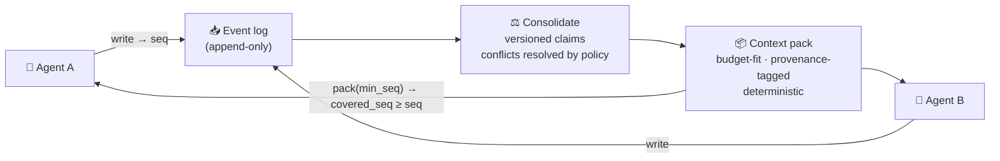

<div align="center">


**Open-source coordination memory for multi-agent AI systems — shared agent memory with
read-your-writes consistency, per-agent access control, and deterministic context packs.**

[](https://github.com/lore-gpt/lore/actions/workflows/ci.yml)
[](LICENSE)
[](https://github.com/lore-gpt/lore/discussions)
[](https://loregpt.ai)

> *Mem0 remembers your user. Zep knows what's true now.*
> ***Lore keeps your agent team in sync*** *— with consistency guarantees, access control, and a token bill that goes down.*

</div>

> 🚧 **Building in the open.** Lore is pre-release. The design is public and evolving through RFCs;
> `v0.1` lands soon. **[→ Join the waitlist](https://loregpt.ai)** for early access and design-partner slots.

---

## Why

Multi-agent systems mostly don't fail because agents can't reason — they fail because agents work over
inconsistent copies of shared state. *(MAST, 1,600+ annotated traces: **36.9%** of multi-agent failures
are inter-agent misalignment; teams burn ~40% of compute re-establishing context.)*

Lore is the memory layer that keeps a **team** of LLM agents working from one reality:

- **Consistency you can call** — `seq` tokens, `covered_seq`, `freshness_lag_ms`: read-your-writes as an
  API contract, not a blog promise. If agent A wrote it, agent B's next pack contains it.
- **Governance built in** — per-agent access control compiled to SQL, trust tiers with quarantine,
  mandatory provenance, human-approved curation.
- **A token bill that goes down** — deterministic, budget-fit context packs maximize prompt-cache hits;
  a built-in meter reports tokens and dollars saved versus raw history.
- **Real open source** — not a library you operate around, a full server: one Go binary with Postgres
  (pgvector + BM25 hybrid search) inside. `docker compose up`, Apache-2.0.

## How it works



1. **Write** — agents stream events; nothing blocks.
2. **Consolidate** — facts become versioned claims; conflicts resolved by policy, not luck.
3. **Pack** — one budget-fit, provenance-tagged, deterministic context block.

```ts
const lore = new LoreClient({ apiKey });

const { runId } = await lore.createRun();
const { seq } = await lore.write({
  runId,
  agentId: "researcher",
  content: "Auth flow moved to v2 — PR #42 merged",
});

const pack = await lore.pack({
  runId,
  query: "current state of auth work",
  scopes: { team: "platform" },
  minSeq: seq,
  tokenBudget: 2000,
});

pack.coveredSeq; // ≥ seq → read-your-writes, guaranteed
pack.savedTokens; // the number your CFO will ask about
```

## Quickstart (self-host)

All you need is **Docker** (with Compose). `lore init` runs from the published image and prints a
docker-compose file — nothing to clone or build:

```bash
docker run --rm ghcr.io/lore-gpt/lore:v0.0.1 init > docker-compose.yml
docker compose up -d --wait
```

<sub>PowerShell: `docker run --rm ghcr.io/lore-gpt/lore:v0.0.1 init | Set-Content docker-compose.yml`</sub>

`up` starts the stack, applies migrations, and runs a one-shot that **provisions a first project** and writes
its id and API key to `./.lore/credentials`. The default extractor is an offline, deterministic fixture, so
the whole write → consolidate → pack loop runs with no API key. Load your credentials:

```bash
set -a; source ./.lore/credentials; set +a   # sets LORE_PROJECT_ID and LORE_API_KEY
```

<sub>The generated compose is pinned to the image's version, so `init` and the stack it scaffolds never drift.
If `./.lore` sits inside a git repository, add `.lore/` to your `.gitignore` — the credentials file holds a key.</sub>

**1 · Check health** — unauthenticated, so orchestrators can probe it:

```bash
curl localhost:8080/healthz
# {"status":"ok","version":"v0.0.1","db":"ok","queue":"ok","workmem":"ok"}
```

**2 · Create a run** — a run groups a stream of events; the project comes from your key, never the body:

```bash
RUN_ID=$(curl -sX POST localhost:8080/v1/runs \
  -H "Authorization: Bearer $LORE_API_KEY" -H "Content-Type: application/json" \
  | grep -o '"run_id":"[^"]*"' | cut -d'"' -f4)
echo "run=$RUN_ID"
```

**3 · Append an event** — the write path lands on that run:

```bash
curl -X POST localhost:8080/v1/events \
  -H "Authorization: Bearer $LORE_API_KEY" \
  -H "Content-Type: application/json" \
  -d "{\"run_id\":\"$RUN_ID\",\"agent_id\":\"researcher\",\"payload\":{\"note\":\"auth flow moved to v2\"}}"
# {"event_id":"...","seq":1}   (HTTP 202)
```

**4 · Pack context** — a deterministic, budget-fit context pack for the run. `min_seq` asserts
read-your-writes: the pack reflects the event you just wrote (raw until extraction distills it):

```bash
curl -sX POST localhost:8080/v1/pack \
  -H "Authorization: Bearer $LORE_API_KEY" \
  -H "Content-Type: application/json" \
  -d "{\"run_id\":\"$RUN_ID\",\"query\":\"auth work\",\"min_seq\":1}"
# with the lore binary instead of curl:  lore pack --run-id "$RUN_ID" --query "auth work" --min-seq 1
```

**Inspect what's stored** (read-only, project-scoped): browse or lexically search the distilled memories,
view a memory's version history, soft-delete one, or replay a run's pack trace. Search uses only the lexical
index, so it needs no embedding model:

```bash
curl -s "localhost:8080/v1/memories?limit=10"  -H "Authorization: Bearer $LORE_API_KEY"   # browse (keyset-paginated)
curl -s "localhost:8080/v1/memories?q=auth"    -H "Authorization: Bearer $LORE_API_KEY"   # lexical search
curl -s "localhost:8080/v1/runs/$RUN_ID/trace" -H "Authorization: Bearer $LORE_API_KEY"   # this run's pack history
```

**5 · Tear it down:**

```bash
docker compose down -v
```

Every step above is also a `lore` subcommand for running outside Docker: `lore provision` (create a project
and mint a key), `lore pack` (fetch a context pack), and `lore doctor` (check the database, schema, and
server). Run `lore --help` for the full list.

> **Port 8080 already in use?** Pick a free host port; the container still listens on 8080:
> `LORE_HTTP_PORT=18080 docker compose up -d --wait`

> **Building from source?** Clone the repo and use the build-from-source compose instead of the published
> image: `docker compose -f infra/docker-compose.yml up -d --build --wait` (or `task compose:up`, the dev
> entry point for lint/test/build too).

> **Diagnostics UI.** The compose stack — both the `lore init` scaffold and build-from-source — also starts a
> read-only web Inspector at [localhost:3000](http://localhost:3000) — browse memories, view run traces, and
> soft-delete — that auto-connects to the local stack. It is one extra container, bound to localhost only. It is
> unauthenticated (it rejects non-loopback Host headers, but adds no login), so never expose it to a network or
> put an auth-less reverse proxy in front of it. Delete the `lore-inspector` block from the compose file to run
> headless.

<details>
<summary><b>Configuration</b> — run the binary outside Compose</summary>

Copy [`.env.example`](.env.example) to `.env` and set:

| Variable | Required | Default | Purpose |
|---|---|---|---|
| `LORE_DATABASE_URL` | yes | — | Postgres (ParadeDB) connection string |
| `LORE_ADDR` | no | `:8080` | HTTP listen address |
| `LORE_VALKEY_URL` | no | — | Working-memory hot lane (Valkey); unset → durable fallback |
| `LORE_WORKMEM_MAX_VALUE_BYTES` | no | `8192` | Max bytes per working-memory fact value (enforced at ingestion) |
| `LORE_METRICS_ENABLED` | no | `true` | Expose the Prometheus `/metrics` endpoint |
| `LORE_METRICS_ADDR` | no | `:9090` | Worker's `/metrics` listener (the server serves `/metrics` on its API port) |
| `LORE_OTEL_ENABLED` | no | `false` | Export OpenTelemetry traces over OTLP (also needs an endpoint below) |
| `OTEL_EXPORTER_OTLP_ENDPOINT` | with tracing | — | OTLP/HTTP collector base URL; the standard OTel variable (`OTEL_EXPORTER_OTLP_TRACES_ENDPOINT` overrides it for traces) |
| `LORE_EMBEDDING_PROVIDER` | no | fixture | `openai` for a real vector space; unset/`fixture` keeps the offline fixture |
| `LORE_EMBEDDING_BASE_URL` | no | OpenAI | Any OpenAI-compatible `/v1/embeddings` endpoint (OpenAI, a self-hosted TEI/Ollama/vLLM server) |
| `LORE_EMBEDDING_MODEL` | with `openai` | — | Embedding model name |
| `LORE_EMBEDDING_DIM` | with `openai` | — | Vector dimension (asserted against every response) |
| `LORE_EMBEDDING_SEND_DIMENSIONS` | no | `false` | Send the `dimensions` request field (OpenAI-family truncation); leave off for a self-hosted server that rejects an unknown field |
| `LORE_EMBEDDING_API_KEY` | no | — | Bearer token for the endpoint; omit for a self-hosted server that needs none |

**Embeddings.** Retrieval embeds each memory and each query. By default that runs on an offline, deterministic
**fixture** embedder — reproducible, but not a semantic vector space. For real semantic recall, set
`LORE_EMBEDDING_PROVIDER=openai` with a model and dimension pointing at any OpenAI-compatible endpoint. Set the
same values for **both** `serve` and `worker` so the query and the stored vectors share one space. The active
model is pinned per project on first embed; **changing the model or the dimension opens a new vector space**, so
an existing project would need a re-embedding migration. `lore doctor` and `/healthz` report the active
embedder identity (`model@dim`).

**Metrics.** Prometheus metrics are exposed at `/metrics` (HTTP latency, the pack freshness-lag SLO, retrieval
legs and path, consolidation outcomes, queue depth and oldest-job age). The endpoint is **unauthenticated**,
like `/healthz` — don't expose the metrics port to the internet; bind it to an internal network and scrape it
there. `/healthz` reports process and dependency health.

**Tracing.** OpenTelemetry traces are **off by default**. Set `LORE_OTEL_ENABLED=true` and an
`OTEL_EXPORTER_OTLP_ENDPOINT` (any OTLP/HTTP collector) to export them. Spans cover the HTTP request, the job
pipeline (extraction → consolidation → embedding), and the pack read path (build → hybrid retrieval); the
inbound request's trace context is carried into the enqueued job as a span link, so a request and the async
work it triggers stay connected. Span attributes carry counts and identifiers only — never memory content, a
query string, or an event payload. Enabling tracing without an endpoint stays a silent no-op, and an exporter
error never takes the process down. All standard `OTEL_EXPORTER_OTLP_*` variables (endpoint, headers, protocol)
are honoured.

API keys are not configured through the environment: mint one per project with `lore keys create --project
<id>` (it prints the token once) and revoke it with `lore keys revoke <id>`.

</details>

## Works with

SDKs for **TypeScript** and **Python**, plus an **MCP server** for everything else — Claude Code,
Cursor, and any MCP client (`v0.1`). Framework-neutral by design: **LangGraph, CrewAI, AutoGen,
Claude Agent SDK, OpenAI Agents SDK, Pydantic AI** — no framework shares memory with a competitor's
agent; Lore does. Integration guides: [loregpt.ai/integrations](https://loregpt.ai/integrations).

## How Lore compares

| | [Mem0](https://loregpt.ai/compare/mem0) | [Zep](https://loregpt.ai/compare/zep) | **Lore** |
|---|---|---|---|
| Primary question | "Who is my user?" | "What is true now?" | **"Is my agent team in sync?"** |
| Read-your-writes contract | — | — | ✓ `seq` / `covered_seq` |
| Per-agent access control | basic scopes | governed messaging | ✓ SQL-compiled + quarantine |
| OSS scope | engine | library | **full server, one binary** |

Honest, same-judge comparisons (including *when to choose them*): [loregpt.ai/compare](https://loregpt.ai/compare)

## Status & roadmap

Lore is being built in the open. Current focus: **`v0.1` MVP** — write → consolidate → pack, hybrid
recall (vector + BM25 + entity), MCP server + TS/Python SDKs, minimal inspector.

- 🗺️ **Design & RFCs:** [`docs/rfcs/`](docs/rfcs) — the read-your-writes contract and the coordination
  benchmark are being designed in the open. Feedback wanted.
- 💬 **Discussion:** [GitHub Discussions](../../discussions)
- 📰 **Blog:** [loregpt.ai/blog](https://loregpt.ai/blog) — agent memory, context engineering, benchmarks

## Open source & what's paid

The full server is **Apache-2.0**: write/read pipeline, scope model, MCP server, SDKs, basic inspector.
A hosted cloud and advanced governance (advanced ACL, curation workflow, analytics) fund the project.
The boundary is public and stable — no surprises. See
[the OSS and paid boundary](.github/CONTRIBUTING.md#the-oss-and-paid-boundary).

## Contributing

RFCs, issues, and early design feedback are welcome — start with [CONTRIBUTING.md](.github/CONTRIBUTING.md).
Found a security issue? See [SECURITY.md](.github/SECURITY.md).

## License

[Apache-2.0](LICENSE) © The LoreGPT Authors
